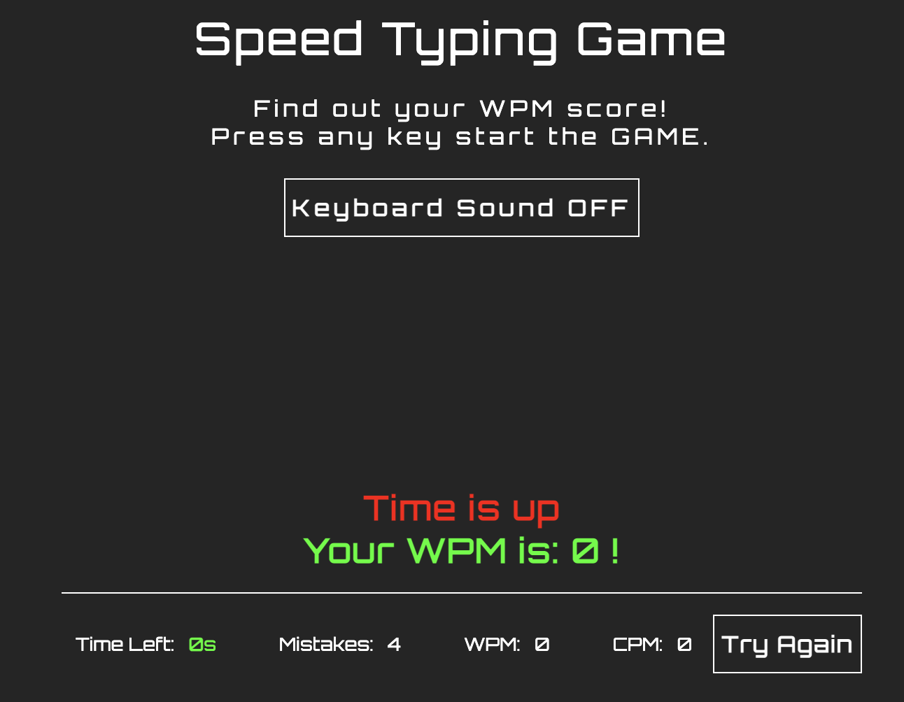
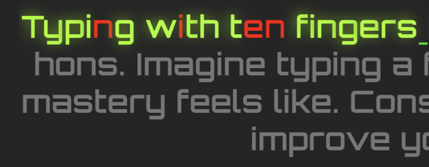
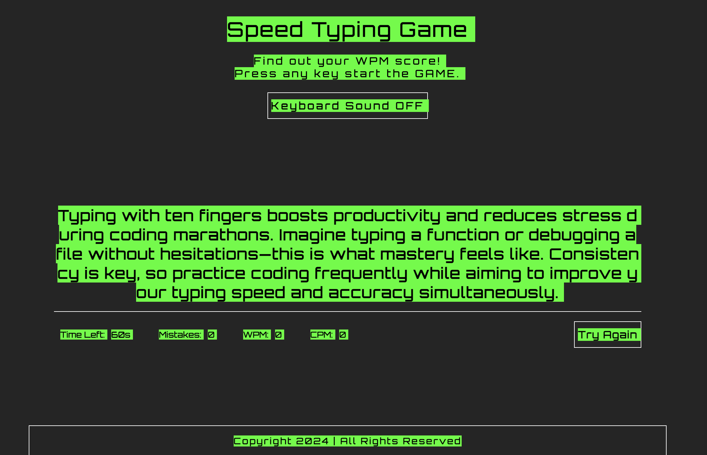
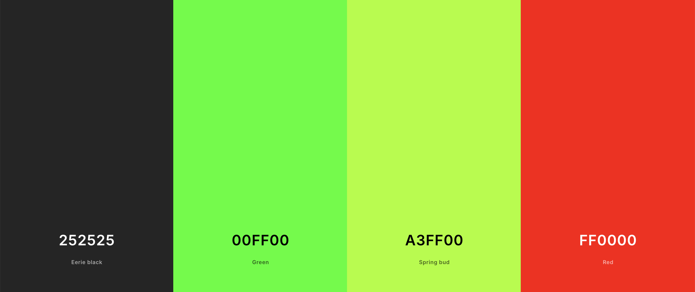
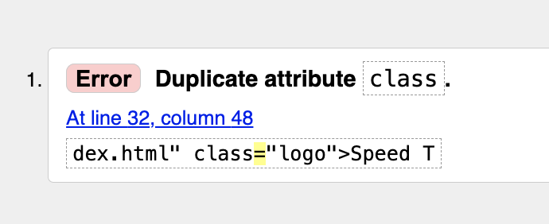
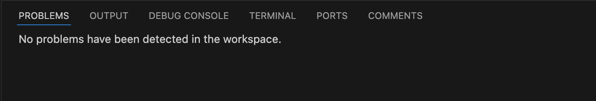
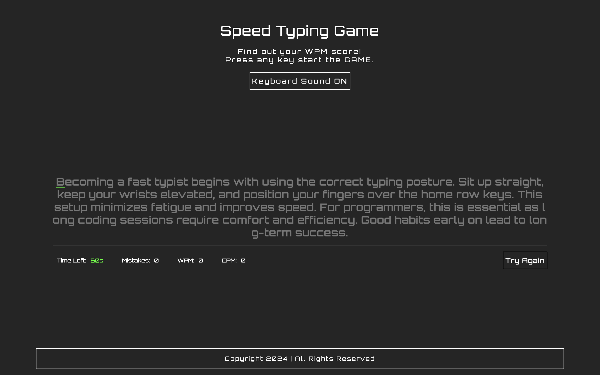
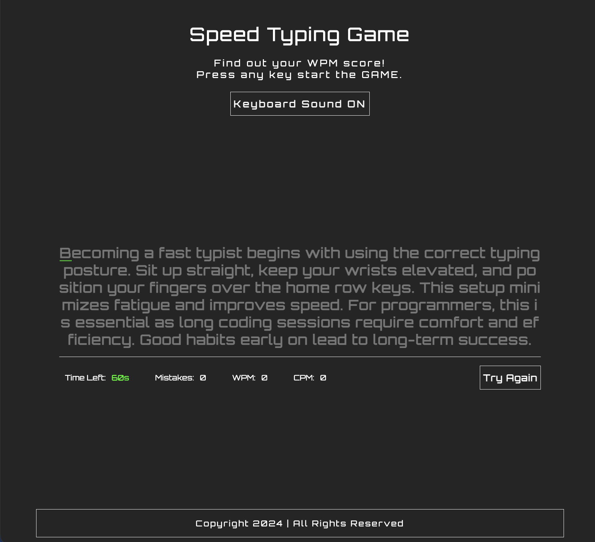
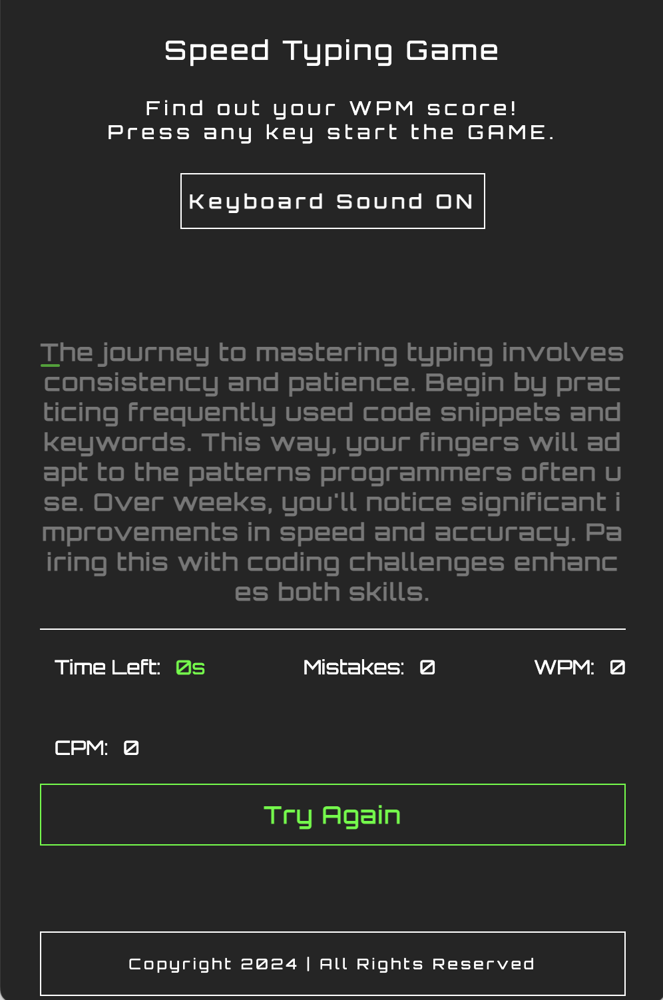

# **Speed Typing Game**

[Click here to go to the Live Project](https://razmikmovsisyan.github.io/typing-game/)


Welcome to my very first Javascript Project!

The website features a typing game that allows users to test and improve their typing speed. It tracks metrics such as words per minute (WPM), characters per minute (CPM), and errors made during the game. 
Players are timed and must type the displayed words correctly.

## **Table of contents**

- [**Speed Typing Game**](#speed-typing-game)
  - [**Table of contents**](#table-of-contents)
  - [**Planning**](#planning)
    - [**Site Owner Goals**](#site-owner-goals)
    - [**User Stories**](#user-stories)
  - [**Features**](#features)
    - [**Used Technologies**](#used-technologies)
    - [**Adaptive Layout**](#adaptive-layout)
  - [**Color Scheme**](#color-scheme)
  - [**Fonts**](#fonts)
  - [**Testing**](#testing)
    - [**Manual Testing**](#manual-testing)
    - [**Validation and Issues**](#validation-and-issues)
      - [**HTML**](#html)
      - [**CSS**](#css)
      - [**JavaScript**](#javascript)
    - [**Bugs**](#bugs)
  - [**Deployment**](#deployment)
  - [**Version Control**](#version-control)
  - [**Development Process and Commands**](#development-process-and-commands)
  - [**Clone and Fork the Repository**](#clone-and-fork-the-repository)
    - [**Clone the Repository**](#clone-the-repository)
    - [**Fork the Repository**](#fork-the-repository)
  - [**Future Enhancements**](#future-enhancements)
  - [**Credits**](#credits)
  - [**Finished Product**](#finished-product)

## **Planning**

### **Site Owner Goals**

- As a site owner, I want to provide an interactive typing game that helps users improve their typing skills in an engaging way.
- As a site owner, I want to track users' progress with metrics like words per minute and accuracy to motivate continuous improvement.
- As a site owner, I want the game to be accessible and enjoyable for all types of players, regardless of their experience level.
- As a site owner, I want a visually appealing and user-friendly interface to keep players engaged.

### **User Stories**

- As a user, I want to test and challenge my typing speed to track my improvement over time.
- As a user, I want to see real-time feedback on my typing performance, including speed and accuracy.
- As a user, I want to play an easy-to-understand game that helps me improve my typing skills while having fun.
- As a user, I want to set new personal bests and challenge myself with each game session.
- As a user, I want to replay the game and refine my typing skills continuously.

## **Features**

**Typing Game** is a responsive typing test designed to improve users' typing speed and accuracy. 
With a minimalist layout, it provides an engaging and accessible experience. 

The game includes real-time feedback, speed and accuracy metrics, and a try again/restart feature for continuous practice.

|  |  |
|:---:|:---:|

The logo, message area, footer, and buttons feature letter spacing to create a retro, arcade-style design.
I also adjusted the selector color to match the overall aesthetic.



To make the game more interactive, I implemented a keyboard sound effect that enhances user engagement. Additionally, I added a toggle button directly beneath the text logo, allowing users to easily enable or disable the sound effect.  

All buttons feature hover and active states with smooth animations for a polished feel. The buttons also include a pointer cursor effect to indicate interactivity. 

Elements like the results table (showing WPM and CPM), footer, and other interactive components include hover effects, adding playful touches and vibrant colors to the design.  

#### **Used Technologies**

- **HTML:** Hyper Text Markup Language
- **CSS:** Cascading Style Sheets
- **JavaSctipt**

#### Adaptive Layout

The layout is designed with padding on both sides of the content, ensuring items align properly and the design remains consistent across devices. On smaller screens, the layout keeps to stack elements vertically, optimizing the user experience. This design is achieved through flexbox properties and responsive design principles, ensuring accessibility and usability on any screen size.

## **Color Scheme**

I chose the CMD light green color on a dark grey background because it provides a high-contrast, retro-tech aesthetic reminiscent of classic command-line interfaces, which fits the theme of a typing game. This combination ensures excellent readability and minimizes eye strain, especially on darker screens.

For the text feedback, the shining shadowed green for correctly typed characters visually rewards accurate typing, creating a sense of achievement, while the simple red for errors offers a clear and immediate indicator of mistakes. This logical contrast helps users focus and improve their typing accuracy effectively.



## Fonts

I chose the Google Font **Orbitron** for this game because of its futuristic and digital look, which aligns well with the theme of a fast-paced typing game. 
Its geometric design provides a clean and modern appearance, making it easy to read while also adding a dynamic, tech-inspired touch to the overall aesthetic. This choice enhances the user's experience by visually reinforcing the game’s focus on speed and precision, creating an engaging and immersive environment for players.

**Sans-Serif** as the fallback font to ensure that, if Montserrat isn't available, a clean, modern, and easily readable font is used. Sans-serif fonts are also widely supported across devices and browsers, maintaining a legible appearance, even if the primary font fails to load.

## Testing

### Manual Testing
- While building the project I have used Chrome and Safari Browser on my MacBook and iOS device.
- I tested the responsive design of the website on Safari, Chrome, Firefox, and Edge using a Windows OS.
- I then shared the website with friends to confirm functionality across different devices and gathered their feedback on user experience.

### Validation and Issues

#### HTML

#### index.html

Due to the simple and compact one-page layout, I didn’t encounter any significant bugs in the HTML code, apart from a minor oversight. This streamlined structure allowed for efficient development, and the focus on clarity and usability minimized potential coding issues. The overall design ensures smooth performance, and any minor errors were promptly addressed during testing.



#### CSS  

Using the input method, I copied and pasted the code of styles.css in **Jigsaw** to validate.

**Result: No errors found.**

#### JavaScript

Using **JsHint** I tested my JavaScript code.

**Result: No errors found.**

Links to PDF Files of Validated Source Codes:

- [`index.html`](assets/readme/pdf-files/html-code-validation.pdf)

- [`styles.css`](assets/readme/pdf-files/css-code-validation.pdf)

- [`script.js`](assets/readme/pdf-files/javascript-code-validation.pdf)

## Bugs

There are no unfixed bugs or problems.



## **Deployment**

I followed Code Institue's Love Running Tutorial tip and deployed my website early. The steps to deploying a website on GitHub pages are:

1. Open the [repository](https://github.com/RazmikMovsisyan/typing-game) and go to the **Settings** tab.
2. Navigate to the **Pages** tab in the left menu.
3. Choose **Deploy from a branch** and select the according branch, *main* in my case.
4. Click save. The link to the deployed website can then be found in the [repository](https://github.com/RazmikMovsisyan/typing-game) on the right menu under **Environments**.

The link to my live site is: [Speed Typing Game](https://razmikmovsisyan.github.io/typing-game/)

## Version Control
* The sourse of code is stored in the [GitHub](https://github.com/) page.
* The repository contains a single branch, and all code has been submitted and commited as it was written, to ensure a good understanding. The repository can be found at this [Link](https://github.com/RazmikMovsisyan/typing-game), and can be downloaded or cloned for further development.

## Development Process and Commands

- I started the program and repository by using the [gitpod template](https://github.com/Code-Institute-Org/gitpod-full-template) provided by the Code Insitute.  
- Then I regularly staged my changes using the command `git add <filename>` or `git add .` and then committed the staged changes to my local repository using `git commit -m 'short descriptive message here'`. 
- Finally, I would push the commits from my local repository up to the Github repository using the command `git push`.
- With every push, Github automatically deploys my latest commit from the 'main' branch to the Github pages.

## Clone and Fork the Repository

You can easily clone or fork the **Speed Typing Game** repository to make changes or use it as a reference. Follow the steps below based on your operating system:


#### **Fork the Repository**

1. Visit the repository on GitHub: [Speed Typing Game Repository](https://github.com/RazmikMovsisyan/typing-game).  
2. Click the **Fork** button in the top-right corner to create your own copy of the repository under your GitHub account.


#### **Clone the Repository**

The repository has a single branch, with code committed sequentially for clarity. It can be forked or cloned for further development.

##### For **Mac** Users:

1. Open the **Terminal**.
2. Navigate to the directory where you want to clone the repository:  
   ```bash
   cd /path/to/your/directory
   ```
3. Run the following command to clone the repository:  
   ```bash
   git clone https://github.com/RazmikMovsisyan/typing-game.git
   ```
4. Navigate into the cloned directory:  
   ```bash
   cd typing-game
   ```

##### For **Windows** Users:

1. Open **Command Prompt** or **PowerShell**.
2. Navigate to the directory where you want to clone the repository:  
   ```cmd
   cd C:\path\to\your\directory
   ```
3. Run the following command to clone the repository:  
   ```cmd
   git clone https://github.com/RazmikMovsisyan/typing-game.git
   ```
4. Navigate into the cloned directory:  
   ```cmd
   cd typing-game
   ```

## Future Enhancements

To further improve the typing game, I would add the following features:

- **Difficulty Levels:** Allow users to choose between beginner, intermediate, and advanced levels with varying word complexity.
- **Maximum Score Tracking:** Display the highest achieved score instead of reseting the score.
- **Timer Options:** Introduce customizable timers for short or extended typing sessions.

## Credits

- [Am I Responsive](https://ui.dev/amiresponsive)
Used to create a mockup for testing website responsiveness on various devices.
- [Google Fonts](https://fonts.google.com/)
Used for the Orbitron font on the site.
- [Icons8](https://www.flaticon.com/free-icon/typing_2222388/) Favicon.

## Finished Product

I’ve taken full-page screenshots of the entire website, showcasing both the desktop and mobile versions. 

I hope to have inspired you, and I greatly appreciate your interest in my project.

Author: [Razmik Movsisyan](https://github.com/RazmikMovsisyan)

|  |  |  |
|:---:|:---:|:---:|

